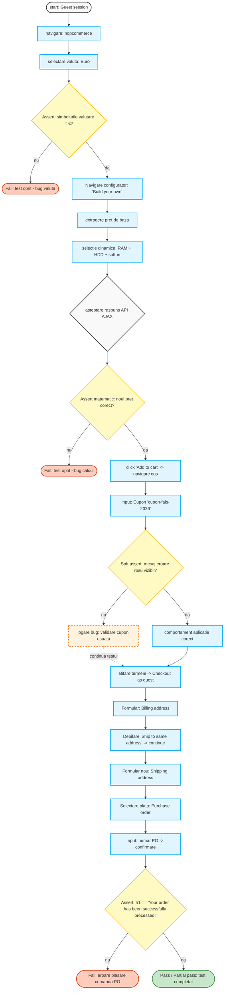
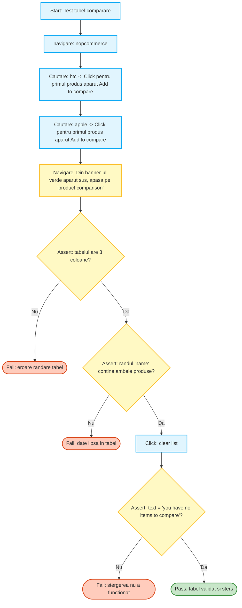
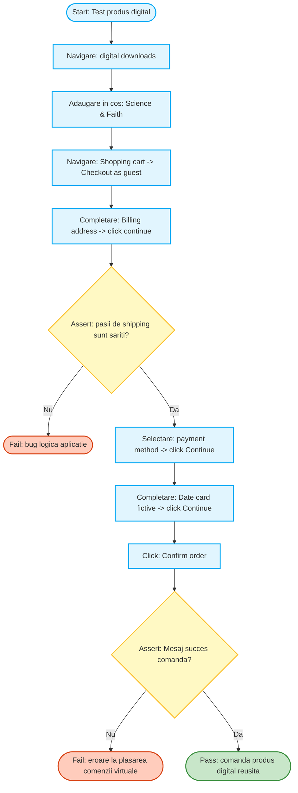
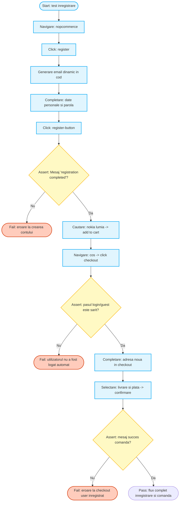
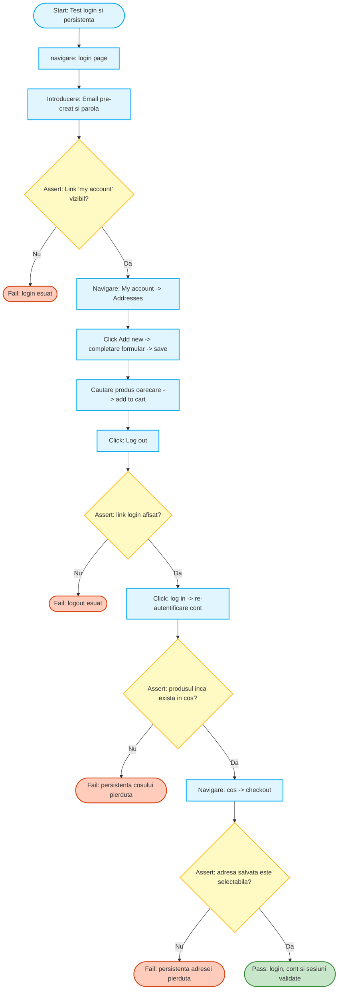

# Proiect Testarea Sistemelor Software

Descriere workflow-uri 

1. Cumparaturi fara cont (Guest mega-flow)

Preconditii:

    Deschidem o sesiune de browser noua (incognito) ca sa nu fim logati in vreun cont.

    Cosul de cumparaturi si wishlist-ul trebuie sa fie complet goale inainte de a rula testul.

Pasi de testare:

    Navigam prin meniu si aplicam un filtru asincron pe categorii (ex: selectam doar laptopurile cu 16 GB RAM).

    Punem un produs in wishlist si verificam ca apare notificarea verde pe ecran.

    Mergem in wishlist si transferam produsul direct in cosul de cumparaturi.

    Trecem prin tot procesul de checkout folosind optiunea "Checkout as guest" (fara cont).

    Completam adresa de facturare si alegem plata cu cardul (credit card).

    (Assert principal) Verificam la final ca aplicatia nu s-a blocat si ca primim mesajul "Your order has been successfully processed!".

```mermaid
graph TD
    classDef precond fill:#f9f9f9,stroke:#333,stroke-width:2px;
    classDef actiune fill:#e1f5fe,stroke:#03a9f4,stroke-width:2px;
    classDef asertiune fill:#fff9c4,stroke:#fbc02d,stroke-width:2px;
    classDef pass fill:#c8e6c9,stroke:#388e3c,stroke-width:2px;
    classDef fail fill:#ffccbc,stroke:#d84315,stroke-width:2px;
    
    A([start: initiere sesiune guest]):::precond --> B[navigare: demo.nopcommerce.com]:::actiune
    B --> C[hover 'Computers' -> click 'Notebooks']:::actiune
    
    C --> D[selectare filtru: 16 GB RAM]:::actiune
    D --> E{Assert: produsele sunt filtrate asincron?}:::asertiune
    E -- Nu --> F([Fail: eroare la incarcarea filtrelor]):::fail
    E -- Da --> G[click: 'Add to wishlist' pentru primul produs afisat]:::actiune
    
    G --> H{Assert: notificarea verde este vizibila?}:::asertiune
    H -- Nu --> F
    H -- Da --> I[click 'x': inchidere notificare toast]:::actiune
    
    I --> J[navigare: Wishlist]:::actiune
    J --> K[bifare produs -> click 'Add to cart']:::actiune
    
    K --> L[update cos: setare Qty=2 & click Update]:::actiune
    L --> M{Assert: pret total dublat corect?}:::asertiune
    M -- Nu --> F
    M -- Da --> N[bifare 'Terms of service' -> click Checkout]:::actiune
    
    N --> O[decizie checkout: click 'Checkout as guest']:::actiune
    O --> P[formular 1: completare Billing address]:::actiune
    
    P --> Q[Asteptare: incarcare state din USA]:::asertiune
    Q --> R[formular 2: selectare 'Next Day Air']:::actiune
    R --> S[formular 3: selectare 'Credit card']:::actiune
    S --> T[formular 4: injectare date fictive card]:::actiune
    
    T --> U[formular 5: click 'Confirm']:::actiune
    
    U --> V{Assert: url = /checkout/completed ?}:::asertiune
    V -- Nu --> W([Fail: eroare procesare plata]):::fail
    V -- Da --> X{Assert: h1 = 'Your order has been successfully processed!'}:::asertiune
    
    X -- Nu --> W
    X -- Da --> Y([Pass: workflow complet]):::pass
```

2. Configurator PC

Preconditii:

    Incepem testul ca vizitator random (sesiune guest).

    Cosul este complet gol la initierea testului.

Pasi de testare:

    Intram pe un produs de tip "Build your own computer".

    Bifam piese suplimentare (memorie RAM mai mare, softuri aditionale) direct din pagina produsului.

    (Assert matematic) Scriptul verifica daca pretul total se actualizeaza corect dinamic pe ecran cand adaugam piese.

    Bagam produsul in cos si incercam intentionat sa aplicam un cod de reducere invalid.

    (Assert negativ) Testul prinde eroarea rosie la cupon, dar foloseste un "soft assert" pentru a nu opri restul executiei.

    Continuam spre checkout si debifam optiunea de "Ship to the same address" ca sa punem o adresa de livrare diferita de cea de facturare.

    Selectam metoda de plata "Purchase order" (comanda B2B pe firma) si punem un cod de identificare.

    (Assert) Confirmam comanda si validam mesajul final de succes.

3. Validarea tabelului de "Compare"

Preconditii:

    Intram pe site fara sa fim autentificati.

    Lista de comparare produse trebuie sa fie curatata de orice rulare anterioara.

Pasi de testare:

    Cautam in magazin primul produs (ex: un telefon) si apasam butonul "Add to compare list".

    Cautam al doilea produs (ex: un laptop) si il adaugam si pe el la comparare.

    Apasam pe linkul din bara verde de notificare ca sa mergem la pagina cu tabelul de comparare.

    (Assert critic) Scriptul citeste direct din tabelul HTML si verifica daca are exact 3 coloane si daca ambele produse apar pe randul de nume.

    Apasam pe butonul "Clear list" ca sa stergem tot.

    (Assert) Verificam ca pe ecran apare textul "You have no items to compare." pentru a confirma stergerea.

4. Produs digital

Preconditii:

    Deschidem o sesiune noua de browser.

    Ne asiguram ca nu avem niciun produs fizic uitat prin cosul de cumparaturi.

Pasi de testare:

    Navigam din meniul principal pe sectiunea "Digital downloads".

    Adaugam un album de muzica (produs pur virtual) in cos.

    Mergem in cos, bifam termenii de utilizare si dam click pe "Checkout as guest".

    Completam adresa de facturare (billing address) cu niste date false de test.

    (Assert logic) Verificam daca site-ul este inteligent si sare complet peste pasii de livrare fizica ("Shipping method"), ducandu-ne direct la pasul de plata.

    Bagam date de card false si plasam comanda.

    (Assert) Verificam url-ul final si afisarea mesajului de confirmare a comenzii virtuale.

workflow 4

5. Inregistrare cont cu email dinamic

Preconditii:

    Scriptul de test este programat sa genereze un email unic la fiecare rulare (ex: adaugand un timestamp la adresa) ca sa nu primim eroare ca utilizatorul exista deja.

Pasi de testare:

    Navigam pe pagina formularului de "Register".

    Completam formularul cu nume, parola si noul email generat in preconditie.

    (Assert) Verificam ca apare mesajul "Your registration completed" dupa ce trimitem datele.

    Cautam un produs pe site si il adaugam in cos.

    Mergem la checkout. Fiindca scriptul ne-a logat automat dupa inregistrare, site-ul nu ne mai pune sa alegem varianta de guest.

    Completam pentru prima data adresa de livrare, alegem plata si confirmam.

    (Assert) Validam inregistrarea comenzii cu succes dintr-un cont abia creat.

workflow 5

6. Testul de memorie, login si persistenta

Preconditii:

    Avem nevoie de un cont valid creat anterior (cu un user si o parola hardcodate in script) care functioneaza permanent.

Pasi de testare:

    Intram pe pagina de "Log in" si ne autentificam cu datele stabilite in preconditii.

    Mergem in pagina "My account" la sectiunea de adrese si salvam o adresa noua in agenda contului.

    Punem un produs oarecare in cosul de cumparaturi.

    Apasam butonul de "Log out" ca sa distrugem intentionat sesiunea.

    (Assert) Verificam ca butonul de login a reaparut in bara de sus.

    Ne logam din nou in site cu aceleasi date.

    (Assert critic) Verificam in header ca produsul este in continuare in cos, demonstrand ca site-ul salveaza cosul in baza de date intre sesiuni.

    Incepem un checkout si verificam daca adresa adaugata anterior apare intr-un dropdown gata de selectat.

